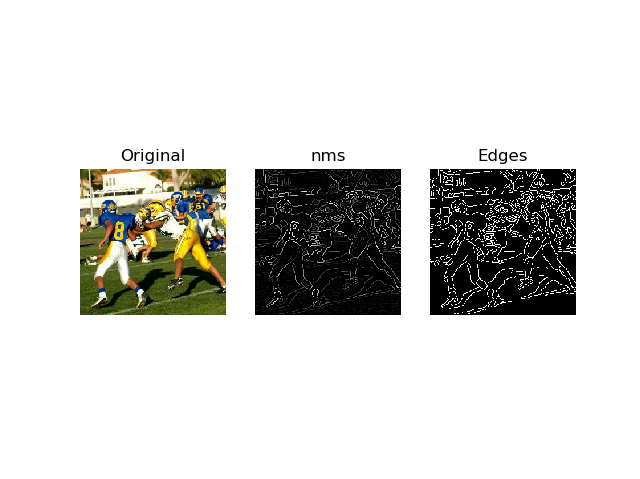

# canny_edge_detector
This repo is an implementation of canny edge detector.

# Setup
  To run the code, you should have these libs installed in your cluster.
  * Python 3.x
  * matplotlib
  * scipy
  
 # Run
 
 To run the code, use command as follows:

 python edge_detector.py <address of image> 

  
 # Results
 
 
 
 
